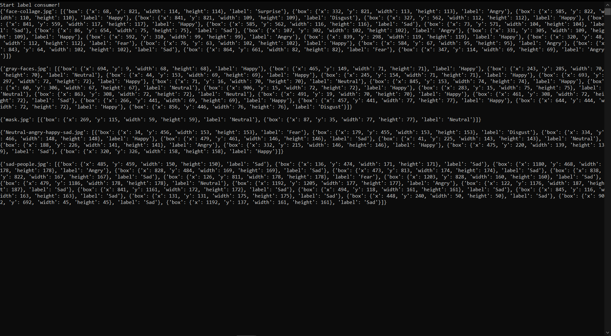

## Descrition:
--------
It is a client-server script to get an images with much faces and recognize it's emotions.

## Run
--------
- First you should run a docker file with kafka client
> start-kafka.bat

- Second you should run a ___main.bat___ script
> main.bat

## Result 
-------
Your saw that your _label-consumer_ get a recognixe data

## End
-------
To stop kafka client you should enter:
> stop-kafka.bat